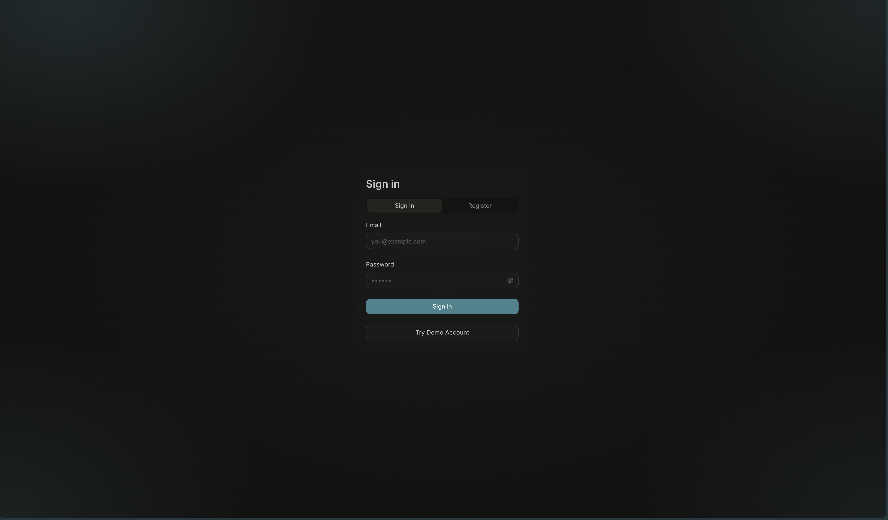
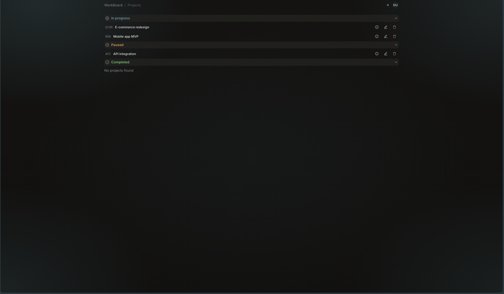
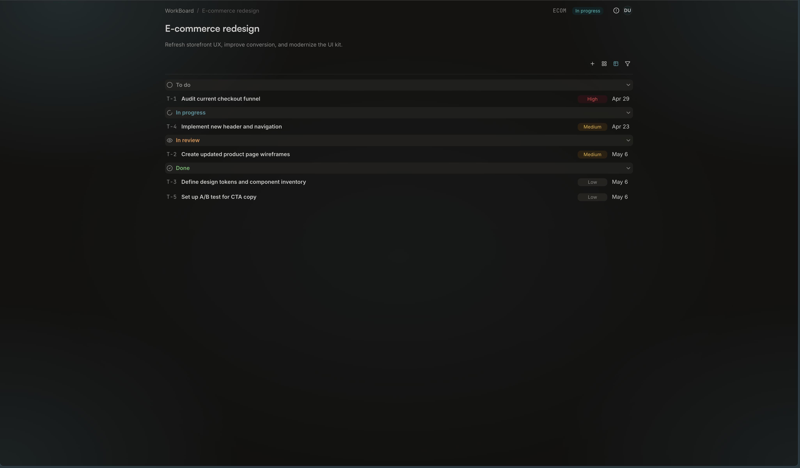
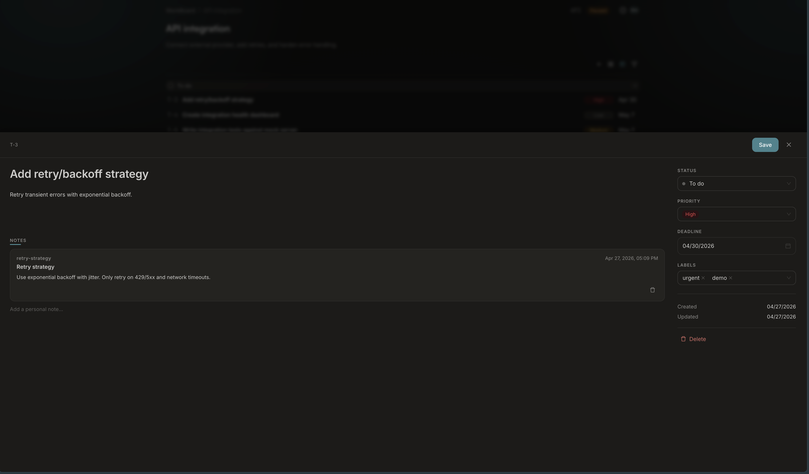
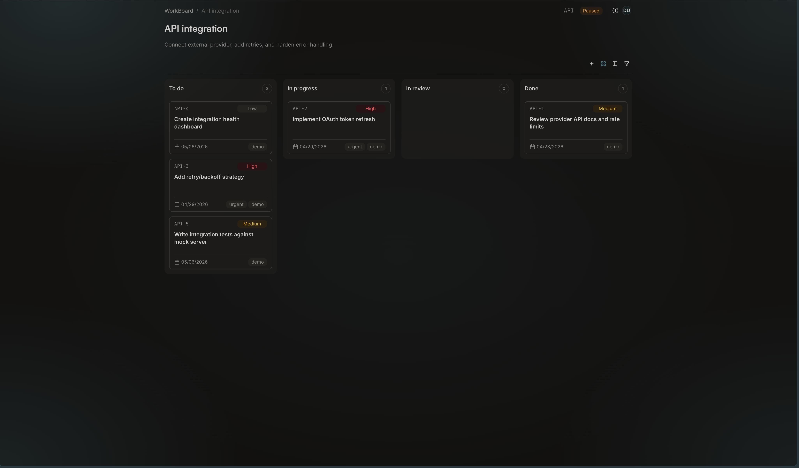

# WorkBoard

A portfolio-grade full-stack demo of a small freelance project workspace. Sign in, browse projects, open a project, and manage tasks in a table or kanban view with a side drawer for details. Comments and task notes are persisted through a real REST API backed by Prisma + SQLite.

This is a monorepo without a root `node_modules`: each package (`frontend/`, `backend/`, `e2e/`) ships its own `package.json` and dependencies.

## Live demo

| Service  | URL |
| -------- | --- |
| Frontend | [workboard-five.vercel.app/login](https://workboard-five.vercel.app/login) |
| Backend  | [workboard-vdp2.onrender.com](https://workboard-vdp2.onrender.com/api/v1/ping) |

> The backend runs on Render free tier and sleeps when idle. The first request after a pause may take a few seconds to wake up.

## Product tour

### Authentication

Email + password sign-in with a separate registration tab on the same screen.



A one-click "Try Demo Account" button provisions a demo workspace and signs the user in without any input.


### Projects

Projects list with create / edit / delete modals and a configurable task key prefix.



### Tasks

Each project opens into a task table with status, priority, labels and due date. Rows lead into a side drawer for full task details.



The table supports sorting and inline interactions:


Filtering narrows tasks by their attributes:


### Task drawer

A dedicated side drawer for inline edits, status changes, persisted comments and personal notes.



### Kanban view

Switch to a kanban board for the same tasks, grouped by status with drag-and-drop between columns.



## Key features

- Email + password auth with JWT, plus a one-click demo workspace bootstrap.
- Projects CRUD with a per-project task key prefix (e.g. `T-1`, `WEB-12`).
- Task table view: status, priority, labels, due date, sorting, filtering, inline edits.
- Task drawer with inline title and description editing, persisted comments (with author) and personal task notes.
- Kanban view of project tasks.
- i18n (English / Russian) for all main screens.
- Real REST API backed by Prisma + SQLite, not local-storage stubs.
- Three-layer test setup: backend integration tests (Vitest + Supertest), frontend unit tests (Vitest + MSW), e2e Playwright suite.

## Stack

| Area     | Technologies                                                                                                                                  |
| -------- | --------------------------------------------------------------------------------------------------------------------------------------------- |
| Frontend | React 19, TypeScript, Vite, Ant Design, TanStack Query, Redux Toolkit, React Router, i18next (en/ru), React Hook Form + Zod, MSW (unit tests) |
| Backend  | Node.js, Express, TypeScript, Prisma, SQLite, JWT (jsonwebtoken), bcryptjs                                                                    |
| Tests    | Vitest (backend + frontend), Playwright (e2e, Chromium)                                                                                       |

Architecture: Feature-Sliced Design on the frontend; modular Express routers + Prisma on the backend.

## Repository structure

```
.
├── backend/          # Express API, Prisma schema & migrations
├── e2e/              # Playwright tests (separate package)
├── frontend/         # Vite + React app (Feature-Sliced Design)
├── docs/screenshots/ # README assets
├── package.json      # root scripts only (test:e2e, test:all)
└── README.md         # this file
```

Per-package details:

- [frontend/README.md](frontend/README.md) — UI flow, FSD layout, scripts.
- [backend/README.md](backend/README.md) — data model, environment, full API reference.
- [e2e/README.md](e2e/README.md) — Playwright setup and covered flows.

## Architecture overview

```
React (Vite, FSD)
    │  HTTP /api/v1
    ▼
Express router (modular: auth, projects, tasks, comments, task-notes)
    │
    ▼
Prisma ORM ──► SQLite (file)

User ─▶ Project ─▶ Task ─▶ Comment
                       └─▶ TaskNote
```

- The frontend talks to the backend via `/api/v1`. In dev, Vite proxies `/api` to `http://localhost:3001`.
- Auth is JWT-based: `Authorization: Bearer <token>` on protected routes.
- Comments belong to a task and carry an author user.
- Task notes are personal, per-task notes for the owner of the parent project.

## Run locally

Requirements: Node.js (see [frontend/.nvmrc](frontend/.nvmrc); ≥ 20.19 for the frontend package).

### Backend

```bash
cd backend
npm install
cp .env.example .env
npx prisma migrate dev
npm run dev
```

|               |                                                                                    |
| ------------- | ---------------------------------------------------------------------------------- |
| API (dev)     | `http://localhost:3001/api/v1`                                                     |
| Health        | `GET /api/v1/ping`                                                                 |
| Prisma Studio | `cd backend && npx prisma studio` → [http://localhost:5555](http://localhost:5555) |
| Env template  | [backend/.env.example](backend/.env.example)                                       |

### Frontend

```bash
cd frontend
npm install
npm run dev
```

|           |                                                                             |
| --------- | --------------------------------------------------------------------------- |
| App       | [http://localhost:5173](http://localhost:5173)                              |
| API proxy | [frontend/vite.config.ts](frontend/vite.config.ts) proxies `/api` → backend |

Run the backend in another terminal when you need auth and CRUD.

## Testing

| Suite             | What it covers                              |
| ----------------- | ------------------------------------------- |
| Backend (Vitest)  | Auth, projects, tasks, comments, task notes |
| Frontend (Vitest) | UI + hooks + MSW integration                |
| E2E (Playwright)  | Auth and projects/tasks flows               |

```bash
npm run test:all          # backend → frontend → e2e
cd backend && npm test    # backend only
cd frontend && npm test   # frontend only
npm run test:e2e          # Playwright only (from repo root)
```

E2E config: [e2e/playwright.config.ts](e2e/playwright.config.ts) (boots the API and the Vite dev server before running Chromium).

## Demo access

The hosted demo and a fresh local install both accept the same demo account:

- Email: `demo@workboard.app`
- Password: `demo123`

The login screen also offers a "Try Demo Account" button. It calls `POST /api/v1/auth/ensure-demo` to provision the demo user and a demo workspace on first use, then signs in automatically.

## Scope / current limitations

- This is a portfolio demo, not a production CRM. Single-user data ownership is intentional — every project belongs to one user.
- Comments support list / create / delete. There is no edit (PATCH) endpoint yet.
- Tasks have full CRUD on the backend; there is no dedicated Supertest file for `/tasks` (covered indirectly via frontend and e2e).
- E2E uses a Russian UI locale via Playwright `storageState` (`crm.language = ru`); the app's default locale is English.
- E2E uses a temporary SQLite file under the system temp directory — see [e2e/e2e-database.ts](e2e/e2e-database.ts).
- No production hardening (rate limiting, audit logging, multi-tenant isolation).

## License

MIT — see [LICENSE](LICENSE).
