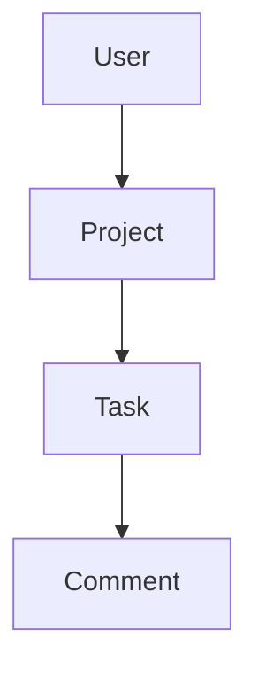

# Freelance CRM — backend

REST API для демо-приложения Freelance CRM. Все маршруты API смонтированы под префиксом **`/api/v1`** (см. `src/app.ts`).

## Стек

| Компонент | Технология |
|-----------|------------|
| Runtime | Node.js |
| Язык | TypeScript |
| HTTP | Express |
| БД | SQLite (файл на диске) |
| ORM | Prisma |
| Пароли | bcryptjs |
| Аутентификация | JWT (`jsonwebtoken`) |
| Dev-сервер | `tsx watch` |

Зависимости и скрипты: см. `package.json`.

## Структура каталогов

| Путь | Назначение |
|------|------------|
| `src/server.ts` | Точка входа: подключение Prisma, `listen`, graceful shutdown |
| `src/app.ts` | Express: `json`, лог запросов, роутер `/api/v1`, 404, обработчик ошибок |
| `src/config/env.ts` | Порт, `DATABASE_URL`, `JWT_SECRET`, `JWT_EXPIRES_IN` |
| `src/db/client.ts` | Экземпляр `PrismaClient` |
| `src/routes/v1/index.ts` | Монтирование модулей: `ping`, `auth`, `projects`, `tasks`, `comments` |
| `src/modules/auth/` | Регистрация, логин, `/me`, JWT, `requireAuth` |
| `src/modules/projects/` | CRUD проектов (только владелец) |
| `src/modules/tasks/` | CRUD задач в рамках проекта пользователя |
| `src/modules/comments/` | Пока только GET-заглушка списка комментариев |
| `src/middleware/` | Логирование запросов, глобальный `errorHandler` |
| `src/shared/http-error.ts` | `HttpError` с полем `statusCode` |
| `src/types/express.d.ts` | Расширение `Express.Request` (`user` после JWT) |
| `prisma/schema.prisma` | Схема данных |
| `prisma/migrations/` | SQL-миграции |

## Переменные окружения

Скопируйте `.env.example` в `.env` и при необходимости измените значения. Секреты в репозиторий не коммитить.

| Переменная | Описание |
|------------|----------|
| `PORT` | Порт HTTP (по умолчанию в коде: `3001`, если не задан) |
| `DATABASE_URL` | Строка подключения SQLite, например `file:./dev.db` (путь относительно каталога `prisma/`) |
| `JWT_SECRET` | Секрет подписи JWT; в production — длинная случайная строка |
| `JWT_EXPIRES_IN` | Срок жизни токена (например `7d`); по умолчанию в коде — `7d` |

## Команды

```bash
cd backend
npm install
npm run dev          # разработка: tsx watch
npm run build        # prisma generate + tsc → dist/
npm start            # node dist/server.js (после build)
```

### Prisma

```bash
npx prisma migrate dev      # создать/применить миграции в разработке
npx prisma migrate deploy   # применить миграции (CI/прод)
npx prisma studio           # GUI для просмотра данных
npx prisma generate         # сгенерировать клиент (обычно уже в npm run build)
```

### Где лежит файл SQLite

При `DATABASE_URL="file:./dev.db"` файл создаётся рядом со схемой Prisma, обычно это:

`backend/prisma/dev.db`

## Модель данных

Иерархия связей:



### User

- `id` (uuid), `email` (unique), `passwordHash`, `name?`, `createdAt`, `updatedAt`

### Project

- `id`, `title`, `description?`, `client?`
- `status`: enum `ProjectStatus` — `active` | `paused` | `done`
- `budget?`, `deadline?`
- `userId` → User
- `createdAt`, `updatedAt`

### Task

- `id`, `title`, `description?`
- `status`: enum `TaskStatus` — `todo` | `in_progress` | `review` | `done`
- `priority`: enum `TaskPriority` — `low` | `medium` | `high`
- `dueDate?`, `labels?` (JSON, массив строк)
- `projectId` → Project
- `createdAt`, `updatedAt`

### Comment

- `id`, `body`, `taskId` → Task, `createdAt`

Подробности полей: `prisma/schema.prisma`.

## API

Базовый URL в примерах: `http://localhost:3001`. Все пути ниже — относительно **`/api/v1`**.

### Публичные эндпоинты (без JWT)

| Метод | Путь | Описание |
|-------|------|----------|
| GET | `/ping` | Health-check: `{ ok: true, message: "pong" }` |
| POST | `/auth/register` | Тело: `{ email, password, name? }` → 201, пользователь + JWT |
| POST | `/auth/login` | Тело: `{ email, password }` → 200, пользователь + JWT |

### Auth (JWT)

Заголовок: `Authorization: Bearer <accessToken>`.

| Метод | Путь | Описание |
|-------|------|----------|
| GET | `/auth/me` | Текущий пользователь: `{ ok: true, user }` |

### Projects (только с JWT, только свои проекты)

| Метод | Путь | Описание |
|-------|------|----------|
| GET | `/projects` | Список проектов пользователя |
| POST | `/projects` | Создание: тело с `title` (обяз.), опционально `description`, `client`, `status`, `budget`, `deadline` (ISO) |
| GET | `/projects/:id` | Один проект (404, если не ваш или не найден) |
| PATCH | `/projects/:id` | Частичное обновление |
| DELETE | `/projects/:id` | Удаление (ответ **204** без тела) |

### Tasks (только с JWT, задачи только внутри своих проектов)

| Метод | Путь | Описание |
|-------|------|----------|
| POST | `/tasks` | Тело: `projectId`, `title`, опционально `description`, `status`, `priority`, `dueDate`, `labels` |
| GET | `/tasks/project/:projectId` | Список задач проекта |
| PATCH | `/tasks/:id` | Частичное обновление задачи |
| DELETE | `/tasks/:id` | Удаление (ответ **204** без тела) |

### Comments (заглушка)

| Метод | Путь | Описание |
|-------|------|----------|
| GET | `/comments/task/:taskId` | Пока возвращает пустой список; **JWT в роуте не используется** — см. roadmap |

## Аутентификация

- Успешные **register** / **login** возвращают JSON вида: `ok`, `user` (без `passwordHash`), `accessToken`, `tokenType` (обычно `Bearer`), `expiresIn`.
- Защищённые маршруты ожидают заголовок `Authorization: Bearer <accessToken>`.

## Ошибки

- Бросается `HttpError` (`src/shared/http-error.ts`) с полем `statusCode`.
- Глобальный обработчик: `src/middleware/errorHandler.ts` — JSON `{ ok: false, message }`.
- Типичные коды: **400** (валидация), **401** (нет/невалидный токен, неверный логин), **404** (не найдено), **409** (например, занятый email при регистрации).

## Связь с фронтендом

Фронтенд лежит в каталоге **`../frontend`**. Базовый URL для запросов к API задаётся на фронте (например `VITE_API_BASE_URL`, по умолчанию часто `/api` при прокси Vite). Подробности интеграции — в корневом `README.md` репозитория.

## Следующие шаги (roadmap)

1. **Комментарии** — полноценный CRUD для `Comment`: создание/чтение/обновление/удаление с проверкой прав (цепочка `comment → task → project → user`).
2. **Безопасность комментариев** — при необходимости включить `requireAuth` на `GET /comments/...` и проверять доступ к задаче.
3. **CORS** — если фронт открывается с другого origin, настроить `cors` в Express.
4. **Валидация** — опционально единая схема тел запросов (например Zod) вместо ручных проверок в сервисах.
5. **Тесты** — unit-тесты сервисов и/или e2e по HTTP.
6. **Production** — надёжный `JWT_SECRET`, `prisma migrate deploy`, структурированные логи вместо только `console`.

---

Документ стоит обновлять при изменении маршрутов в `src/routes/v1` и схемы в `prisma/schema.prisma`.
